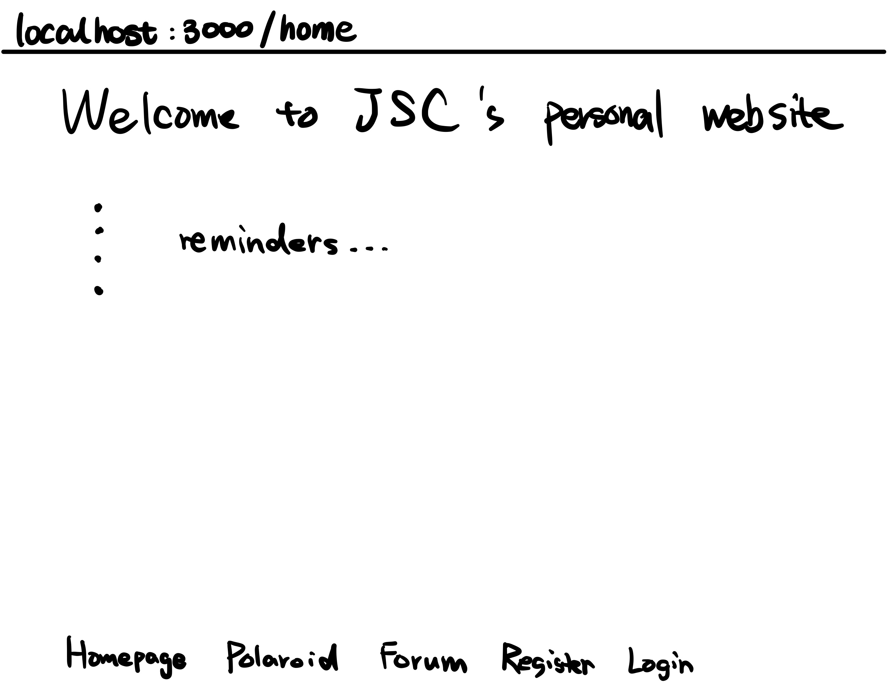
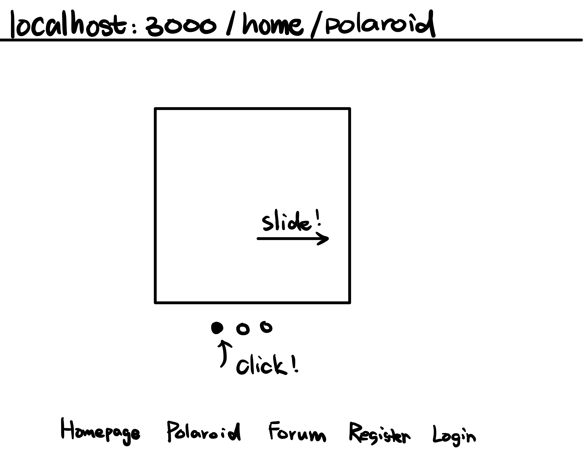
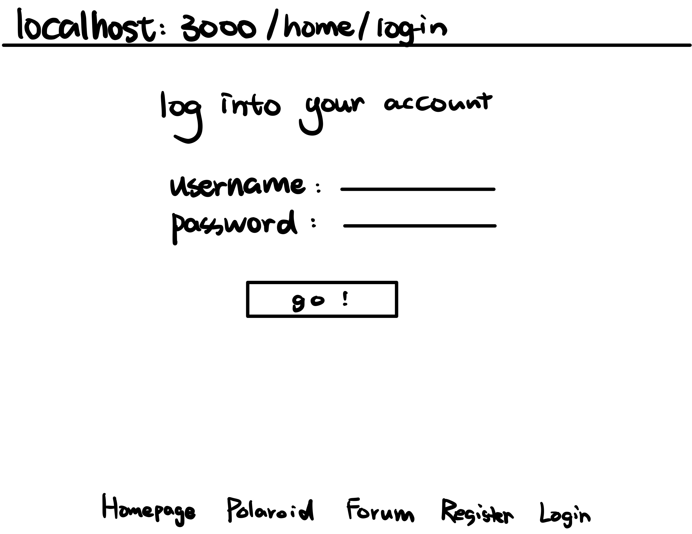
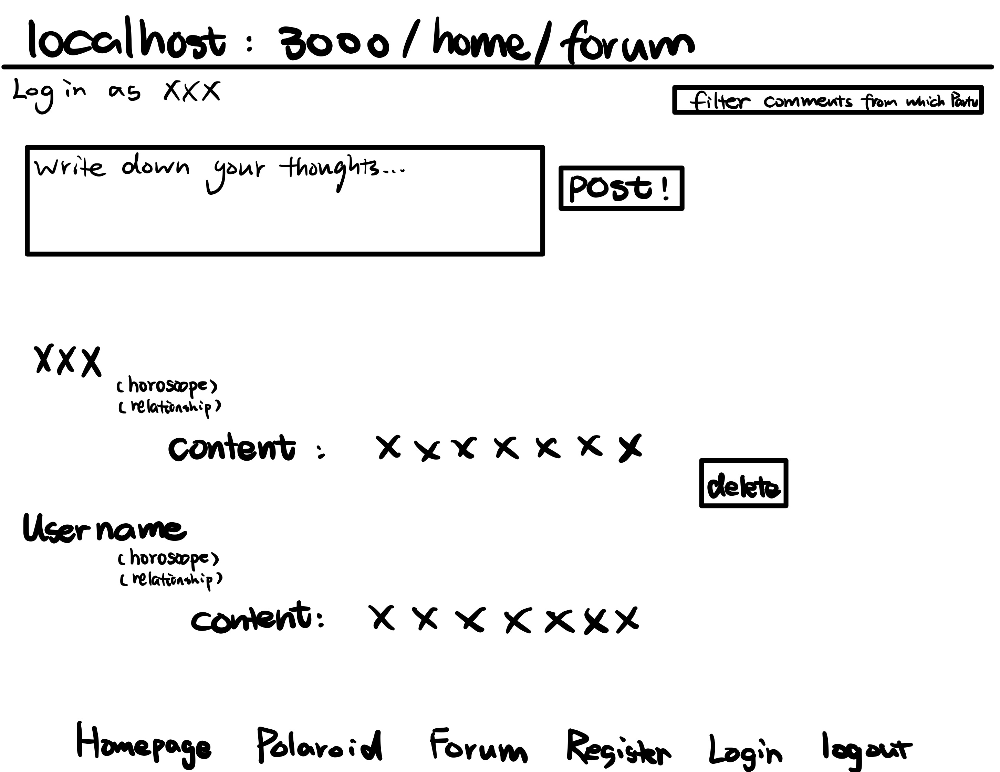

# All About Me

## Overview

This is my portfolio webisite! when clicking into the website, you can read a brief introduction about me, listen to my favarites songs from spotify, and see the polaroids I took with my friends!

More importantly, as my friend, you can create your account which will record your birthday, horoscope, email, and your relationship with me!

There is also a discussion forum in this app. You can only see and post comments in this page with an account. You can also filter discussions from which party(self, families, friends)


## Data Model


The application will store Users and Comments

* users can have multiple comments (via references)


An Example User:

```javascript
{
  name: "wenqi",
  hash: // a password hash,
  horoscope: "Gemini"
  relationship: "self"
  email: "wl2250@nyu.edu"
}
```

An Example Comment:

```javascript
{
  author: // a reference to a User object
  authorName: "Wenqi",
  authorHoroscope: "Gemini",
  authorRelationship: "self",
  content: "hi this is the first comment!"
}
```


## [Link to Commented First Draft Schema](db.mjs) 


## Wireframes

/home - page for introduction, playing music, and list to all sub-pages



/home/polaroid - page for showing all polaroid photos



/home/sign-up - page for creating a new account


/home/log-in - page for logging in with existing account



/home/forum - page for users to discuss



## Site map


## User Stories or Use Cases

0. as non-registered user, I can only view home page and polaroid page
1. as non-registered user, I can register a new account with the site
2. as a user, I can log in to the site
3. as a user, I can create a new discussion
4. as a user, I can see all others' discussion
5. as a user, I can filter discussion with a specific party(families, friends, etc)
6. as a user, I can delete my post

## Research Topics

* (5 points) Integrate user authentication
    * The integrated authentication checks whether there is an authenticated user. If not, it requests the user's credentials (user and password). Once the user is logged into the integrated authentication system, it tells the application which user is logged in.
    * Since the forum page may include some personal or private information, it is important to make sure only authenticated user can see the forum page.
    * Candidate: 
      * Passport.js (authentication middleware for Node.js)
      * JSON Web Tokens (an open, industry standard RFC 7519 method for representing claims securely between two parties)

* (3 points) Perform client side form validation using a custom JavaScript
    * Before submitting data to the server, it is important to ensure all required form controls are filled out, in the correct format
    * When creating account. the user must fill out username, password, and email
    * If the user input something wrong, the error message will appears near the input field
    * Candidate: 
      * custom JavaScript

* (3 points) Unit testing with JavaScript
    * Make sure the client side form validation work as as expected (need to satisfy the requirment for name, email, and password input)
    * Make sure the new-created user will be saved only if all required fields are filled
    * Candidate: 
      * Mocha


11 points total out of 10 required points 


## [Link to Initial Main Project File](app.mjs) 

## Annotations / References Used

1. [passport.js authentication docs](http://passportjs.org/docs)
2. [tutorial on handling Authentication and Authorization with Node (using JWT)](https://medium.com/quick-code/handling-authentication-and-authorization-with-node-7f9548fedde8)
3. [mdn client-side form validation doc](https://developer.mozilla.org/en-US/docs/Learn/Forms/Form_validation)
4. [mocha documentation](https://mochajs.org/)

